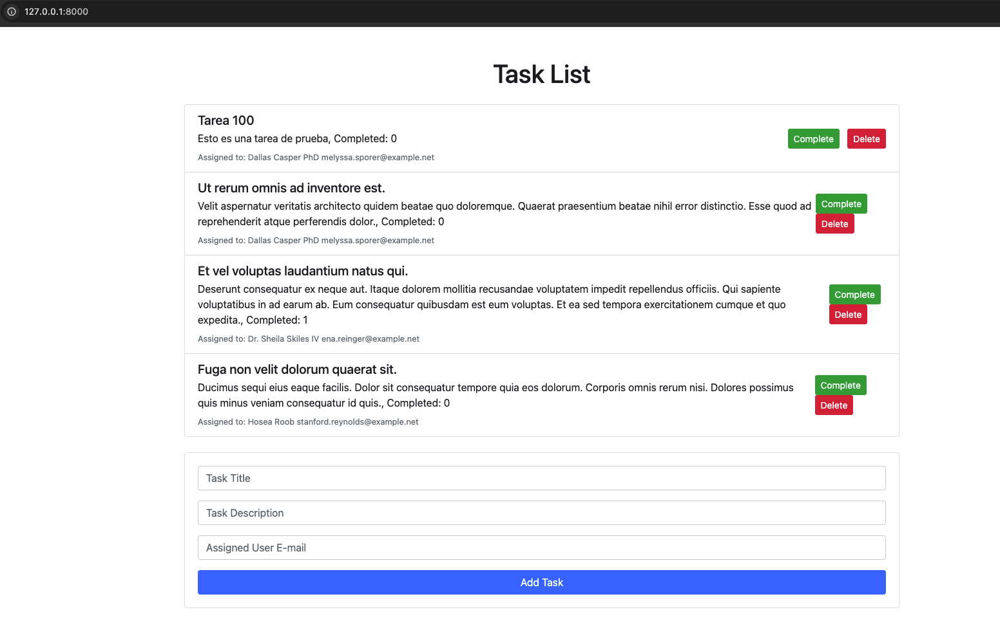

# Prueba Técnica - Sistema de Gestión de Tareas

## Introducción 

Como parte del requisito de esta prueba, yo he documentado los problemas y soluciones encontrados que lo pueden visualizar a partir del texto "Prueba Soporte por Claudia Estupiñán Forero".

El tiempo de duración de esta prueba me tomó aproximadamente 12 horas de las cuales incluye:

- Instalacion y configuracion entorno
- Generacion de la data
- Ajuste inicial de la aplicación tanto en back como en front
- Resolución de problemas
- Documentación
- Carga a GitHub

## Descripción del Proyecto

Este proyecto es un sistema básico de gestión de tareas desarrollado con Laravel y Vue.js. El objetivo de esta prueba técnica es identificar y corregir errores en el código tanto en el backend como en el frontend. El sistema permite a los usuarios crear, actualizar, eliminar y visualizar tareas.

## Objetivo de la Prueba

El objetivo principal de esta prueba es evaluar tus habilidades para depurar y corregir errores en un proyecto existente que utiliza Laravel, PHP, JavaScript, y Vue.js. Deberás:

- Identificar y corregir errores en el backend relacionado con la creación, actualización, eliminación y validación de tareas.
- Corregir problemas en el frontend que afectan la visualización y manejo de la lista de tareas.
- Asegurarte de que las tareas se gestionen correctamente en la interfaz de usuario.

Además, deberás agregar una funcionalidad extra para filtrar las tareas completadas y pendientes.

## Instrucciones de Instalación

Sigue los siguientes pasos para configurar el proyecto en tu entorno local:


1. **Clona el repositorio:**

       Prueba-Soporte
   
2. **Instala las dependencias de PHP y Node.js:**

   .Composer: Para instalar las dependencias de PHP, ejecuta:
   
        composer install

   .NPM: Para instalar las dependencias de Node.js, ejecuta:

        npm install
        npm run dev

3. **Configura el archivo de entorno .env:**

   .Copia el archivo .env.example a .env:

       cp .env.example .env
   
   .Genera la clave de la aplicación:

       php artisan key:generate
   
   .Configura la base de datos en el archivo .env. Asegúrate de tener una base de datos MySQL disponible y configurada.
   
4. **Ejecuta las migraciones para crear las tablas necesarias:**

       php artisan migrate

5. **Compilar Recursos de Frontend:**

   .Compila los archivos de frontend utilizando Laravel Mix:

       npm run dev

6. **Iniciar el Servidor:**

   .Inicia el servidor de desarrollo de Laravel:

       php artisan serve

       
**Objetivo de la Prueba**

El proyecto contiene errores tanto en el backend (Laravel/PHP) como en el frontend (JavaScript). Tu objetivo es:

 1.Identificar los errores en el código.
 2.Corregir los errores para que la aplicación funcione correctamente.
 3.Probar la aplicación después de realizar las correcciones para asegurarte de que todo funcione como se espera.
 
**Entrega**

Sube el código corregido a un repositorio de GitHub y envíanos el enlace. Asegúrate de describir los problemas que encontraste y cómo los solucionaste en este archivo README.md.

**Notas**

Puedes añadir cualquier comentario adicional sobre las decisiones que tomaste al corregir el código.
Recuerda que el objetivo es demostrar tu capacidad para depurar y mejorar código existente.

¡Buena suerte!

---

# Prueba Soporte por Claudia Estupiñán Forero
   
### **Paso 1. Instalación y configuración del entorno**

Problema:

- Se tuvo cierta dificultad al instalar y configurar el entorno ya que en la documentación no se especificaba la versión de PHP, MySQL, Laravel, Composer, NPM, Node, Vue y dependencias de Vue.

Solución: 

- A partir de los archivos base composer.json y package.json se pudo determinar las versiones adecuadas o compatibles para que la aplicación funcione en un entorno MacOS Apple Silicon M1.
    - PHP v7.4
    - Composer v2.7.9
    - MySQL v8.4.2-arm64
    - Node v20.5.1
    - NPM v9.8.1
    - Apache v2.4.62
- Se determina que la aplicación está basada en Laravel 7 y Vue 2.
- Se instalan las dependencias tanto de Composer como las de NPM.
- Se ejecuta el servidor PHP para Laravel y `npm run dev`  en terminal de comandos.

```jsx
php artisan serve // Arranca el servidor PHP para Laravel, única vez.

npm run dev // Solo aplica en modificaciones en el componente Vue 2.
```

- En frontend hubo incompatibilidad de dependencias con `Vue Loader` de la cual se adecuó con la versión `15.10.0` facilitando el empaquetado con Laravel Mix(Webpack).
- En phpMyAdmin se crea una base de datos llamada `laravel`, con un cotejamiento de tipo `utf8mb4_general_ci`
- Se creo el archivo .env de acuerdo a las instrucciones de la cual se establece
    - La generación de la clave de la aplicación APP_KEY `php artisan key:generate`
    - Conexiones a la base de datos en las constantes asociando con el usuario definido en el entorno local.
        
        ```jsx
        DB_DATABASE=laravel
        DB_USERNAME=root
        DB_PASSWORD=
        ```
        

---

### Paso 2.  Migraciones, Fakers y Seeders

Problema:

- La base de datos estaba vacía y sin seeders para obtener registros de acuerdo al modelado de la relación bajo los modelos User y Tasks.

Solución:

- Se ejecutaron las migraciones con `php artisan migrate`
- Se crearon los fakers y seeders para modelos User y Tasks cumpliendo con los campos definidos tanto en el modelo como en el schema.

```jsx
php artisan make:factory UserFactory --model=User
php artisan make:factory TaskFactory --model=Task
```

- En TaskFactory.php se tuvo en cuenta la vinculación de cada registro con el id de un usuario por medio del campo user_id

```jsx

/** @var \Illuminate\Database\Eloquent\Factory $factory */

use App\Models\Task as Task;
use Faker\Generator as Faker;

$factory->define(Task::class, function (Faker $faker) {
    return [
        'title' => $faker->text($maxNbChars = 50),
        'description' => $faker->paragraph,
        'completed' => $faker->boolean,
        'user_id' => function () {
            return factory(App\Models\User::class)->create()->id;
        }
    ];
});

```

- Se crean los seeders UserSeeder.php y TaskSeeder.php los cuales ejecutaran los fakers para obtención de registros aleatorios.

```jsx
 // UserSeeder.php se generan tres registros de usuarios
 public function run()
    {
        $users = factory(User::class, 3)->create();
    }
 
  // TaskSeeder.php se generan doce registros de tareas
  public function run()
    {
        $tasks = factory(Task::class, 12)->create();
    }
```

Ejecución de seeders llamados en el archivo DatabaseSeeder.php

```jsx
php artisan db:seed
```

---

### Paso 3. Aplicación de tareas Task List

Problema 1. El formulario para agregar un Task 

- Se visualizaba el formulario inicial pero al guardar el registro de un Task no mostraba la lista de tareas.
- El campo de nombre User no especifica el dato a ingresar, por ende no guardaba el registro exceptuando si el dato ingresado es un email.

Solución: 

- En el componente TaskList.vue se modifica el objeto `newTask` del cual se agrega un campo llamado `email` y adicionalmente se agrega un campo de tipo objeto llamado `user`.

```jsx
data() {
        return {
            newTask: {
                title: '',
                description: '',
                user: {},
                email: ''
            }
        };
    },
```

- Se modifica el formulario para reemplazar el campo user por campo email. Para temas de usabilidad se especificó que el campo debe ser el e-mail de un User.

```jsx
<input v-model="newTask.email" class="form-control" placeholder="Assigned User E-mail" required>
```

- Se procede a modificar el método addTask tanto en la funcionalidad de validación del formulario como en el dispatch que gestiona el estado de tareas.

```jsx
addTask() {
            if (!this.newTask.title || !this.newTask.description || !this.newTask.email) {
                alert('Both title and description are required');
                return;
            }

            // Se utiliza la acción 'addTask' y luego se limpia el formulario
            this.$store.dispatch('addTask', this.newTask).then(() => {
                this.newTask.title = '';
                this.newTask.description = '';
                this.newTask.email = '';
            }).catch(error => {
                console.error('Error adding task:', error);
            });
        },
```

- En store.js se modifica la acción y la mutación para añadir una tarea “ADD_TASK”.

```jsx
// Acción
 addTask({ commit }, task) {
            axios.post('/tasks', task)
                .then(response => {
                    commit('ADD_TASK', response.data.task);
                })
                .catch(error => {
                    console.error("Error adding task:", error);
                });
        },
```

Cuando se agrega una tarea, se debe actualizar el array de tareas. Se adiciona y se ordena de forma descendente.

```jsx
// Mutación
ADD_TASK(state, task) {
            state.tasks.push(task);
            state.tasks = state.tasks.reverse();
        },
```

- En el backend se modifica la función `store` del controlador `TaskController.php` retornando una respuesta de tipo JSON. Ya que antes habia un redirect que rebota a la misma página informando el error haciendo que la aplicación no cumpla con el propósito de ser una SPA donde las operaciones de datos se realizan por medio de un API REST.

```jsx
public function store(Request $request)
    {
        $validated = $request->validate([
            'title' => 'required|max:255',
            'description' => 'required|max:500',
            'email' => 'required|max:500',
        ]);

        $task = new Task($validated);
        $user = User::where('email',$validated['email'])->first();
        $task->user_id = $user->id;
        $task->save();

        $createdTask = $this->find($task->id);

        return response()->json(['success' => 'Task created successfully.', 'task' => $createdTask]);
    }
```

---

Problema 2. Visualizar la lista de tareas

- La lista de tareas en un principio no aparece.
- Se agrega una tarea pero el estado no actualiza la lista de tareas, muestra que se agrego una nueva tarea en la lista pero no muestra la información de la tarea.

Solución:

- En TaskList.vue se crea un metodo para obtener las tareas llamado fetchTasks()

```jsx
fetchTasks() {
            // Se utiliza la acción 'fetchTasks'
            this.$store.dispatch('fetchTasks').catch(error => {
                console.error('Error fetching tasks:', error);
            });
        }
```

- En el store.js se crea una accion llamada fetchTask que obtendrá la lista de tareas creadas por medio de un servicio axios de tipo GET.

```jsx
fetchTasks({ commit }) {
            axios.get('/tasks')
                .then(response => {
                    commit('FETCH_TASKS', response.data);
                })
                .catch(error => {
                    console.error("Error getting tasks:", error);
                });
        }
```

El mutador toma la lista de tareas provenientes del servicio y las almacena en el estado tasks

```jsx
FETCH_TASKS(state, tasks) {
            state.tasks = tasks;
        }
```

- En el backend TaskController.php se definen dos funciones, fetch y find donde la primera obtiene toda la lista de tareas y el usuario asociado a cada una de ellas, y en la segunda obtiene una tarea a partir de su id.

```jsx
// Obtener tareas
    public function fetch()
    {
        $tasks = Task::with('user:id,name,email')->orderBy('created_at', 'desc')->limit(3)->get();
        return $tasks;
    }

    // Obtener una tarea
    public function find($id)
    {
        $task = Task::with('user:id,name,email')->findOrFail($id);
        return $task;
    }
```

- En routes.php se adicionan las rutas para las funciones previamente definidas

```jsx
Route::get('/tasks', [TaskController::class, 'fetch']);
Route::get('/tasks/{id}', [TaskController::class, 'find']);
```

- En el frontend se modifica TaskList.vue para que muestre el detalle de la tarea y el usuario.

```jsx
<div>
<h5 class="mb-1">{{ task.title }}</h5>
<p class="mb-1">{{ task.description }}, Completed: {{ task.completed }}</p>
<small class="text-muted">Assigned to: {{ task.user.name }} {{ task.user.email }}</small>
</div>
<div>
```



---

### Problema 3. Eliminar una tarea.

- Error de comunicación con el servicio axios.

Solucion:

- En el backend TaskController.php se modificó la funcionalidad que permite eliminar una tarea donde se reemplaza la respuesta de retorno en una con formato JSON. No requiere datos de request para proceso de eliminación.
- En el frontend se modifica la acción deleteTask solo para que reciba como parametro el id de la tarea.

---

### Problema 4. Completar tarea.

- Error de comunicación con el servicio axios.

Solución:

- En el backend TaskController.php se modificó la funcionalidad que permite modificar una tarea donde se reemplaza la respuesta de retorno en una con formato JSON. No requiere datos de request para proceso de eliminación.  Se cambia el valor a continuación ya que es un boolean.

```
$task->completed = !$task->completed;
```

- En el frontend se modifica la acción completedTask solo para que reciba como parámetro el id de la tarea.

---

### Sugerencias:

- Documentar requisitos base de instalación para el funcionamiento correcto de la aplicación. Eso me llevó ciertas horas en resolver ya que no deseaba afectar mi entorno local de otros proyectos hechos en otras versiones. Tengo Docker(Docker en M1 es algo lento para aplicaciones LAMP).
- Especificar la historia de usuario de la funcionalidad del botón Complete. Que sucede al cambiar de estado.
- Despliegue de mensajes luego de haber realizado una acción por el lado del frontend utilizando un setTimeout para mostrar un mensaje por medio de un componente llamado Notification.
- En back utilizar el archivo api.php para guardar las rutas que corresponden al API REST de la aplicación.